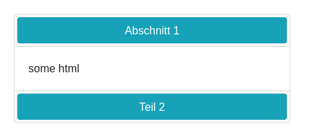

# Accordion

Renders an accordion:


## Options

The contents of the accordion can be set by passing a JSON string that describes the contents in the `data` attribute.

The JSON string is an array containing an object for every entry, each object should have a title and a content field.
The above screenshots results from the following JSON:

```json
[
  {
    "title": "Abschnitt 1",
    "content": "some html"
  },
  {
    "title": "Teil 2",
    "content": "some <b>more</b> html"
  }
]
```
